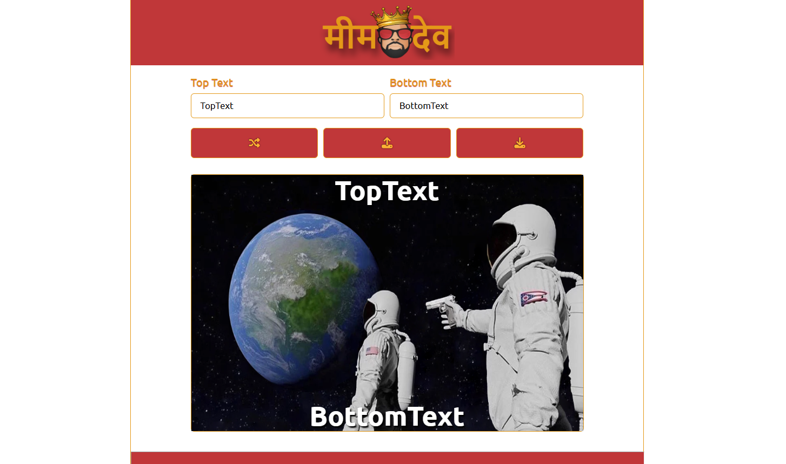

# Portfolio

A modern, responsive portfolio web application built with React and Vite. Showcase your projects, skills, and contact information with a sleek, interactive design.



## 🚀 Features

- **Beautiful Hero Section**: Eye-catching introduction with animated backgrounds.
- **Projects Showcase**: Display your best work with images and descriptions.
- **Skills Section**: Highlight your technical skills with icons and categories.
- **About Section**: Share your story and background.
- **Contact Form**: Easy way for visitors to reach out.
- **Theme Toggle**: Switch between light and dark modes.
- **Responsive Design**: Looks great on all devices.
- **Toast Notifications**: Modern UI feedback for user actions.

## 🛠️ Tech Stack

- [React](https://react.dev/)
- [Vite](https://vitejs.dev/)
- [JavaScript](https://developer.mozilla.org/en-US/docs/Web/JavaScript)
- [CSS](https://developer.mozilla.org/en-US/docs/Web/CSS)

## 📁 Project Structure

```
src/
  App.jsx
  index.css
  main.jsx
  assets/
  components/
    AboutSection.jsx
    ContactSection.jsx
    Footer.jsx
    HeroSection.jsx
    Navbar.jsx
    ProjectsSection.jsx
    SkillsSection.jsx
    StarBackground.jsx
    ThemeToggle.jsx
    ui/
      toast.jsx
      toaster.jsx
  contents/
    projects.js
    skills.js
  hooks/
    use-toast.js
  lib/
    utils.js
  pages/
    Homepage.jsx
    NotFound.jsx
  services/
public/
  images/
    assembly.png
    memedev.png
    shourl.png
```

## 📦 Installation

1. **Clone the repository**
   ```sh
   git clone https://github.com/lohanivaibhav4/Portfolio.git
   cd Portfolio
   ```
2. **Install dependencies**
   ```sh
   npm install
   ```
3. **Start the development server**
   ```sh
   npm run dev
   ```
4. **Open in browser**
   Visit [http://localhost:5173](http://localhost:5173) to view your portfolio.

## 🖌️ Customization

- Update your projects in `src/contents/projects.js`.
- Add your skills in `src/contents/skills.js`.
- Edit sections in `src/components/` for personal details and style.
- Replace images in `public/images/` for your own visuals.

## 📤 Deployment

You can deploy this portfolio easily on platforms like [Vercel](https://vercel.com/), [Netlify](https://www.netlify.com/), or [GitHub Pages](https://pages.github.com/).

## 🙌 Credits

Created by [Vaibhav Lohan](https://github.com/lohanivaibhav4)

---

Feel free to fork, customize, and share your own portfolio!
